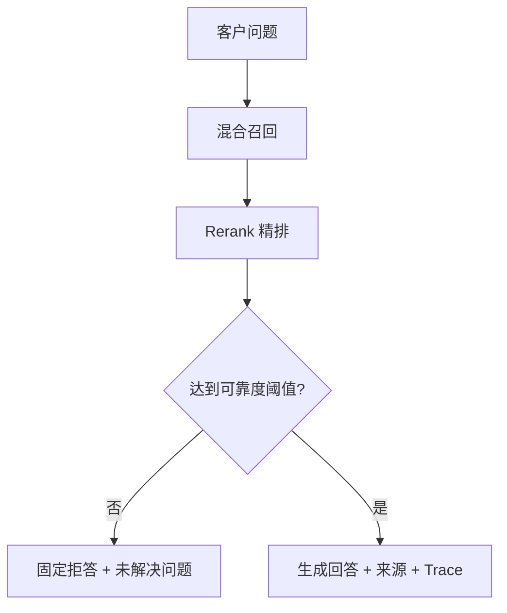

# KnowFlow 商业化落地与验收方案

## 1. 产品定位

KnowFlow 的可销售形态不是“上传 PDF 的聊天页”，而是企业可部署的 AI 客服与知识运营平台：企业导入资料，经过 OCR、向量化、检索与质量门槛生成可靠回答；官网与渠道承接客户；低置信问题转人工；系统追踪线索、SLA、收入、成本与毛利。

第一批客户建议聚焦制造业产品售后。贸易报价和教育咨询保留为行业模板，不同时承诺所有行业。

## 2. 本轮落地矩阵

| 优先级 | 能力 | 已落地内容 | 正式启用条件 |
|---|---|---|---|
| P0 | 真实收费 | 待支付订单、签名收银台、金额/币种/渠道校验、回调防重放、幂等履约、续费延长、退款、到期降级 | 微信/支付宝商户号或聚合支付网关、HTTPS 回调域名 |
| P0 | 回答质量 | 可配置最低可靠度、低分不调用生成模型、拒答文案、点赞/点踩、标准题与拒答题回归 | 上线前至少 10 道业务题和 3 道拒答题通过 |
| P0 | 企业账号 | 首次登录创建企业、企业资料、成员邀请、角色权限、租户切换、离职禁用、人数配额 | Sites 使用平台身份登录；私有化生产建议接企业 OIDC |
| P0 | 隐私合规 | 联系方式提交前同意、隐私版本、最少收集、保存期限、访客导出/删除、自动清理 | 企业提供自己的隐私政策并完成法律审查 |
| P0 | 客服运营 | 负责人、优先级、4 小时默认 SLA、首响/解决时间、事件轨迹、企微/邮件/短信/Webhook 通知与重试 | 配置通知地址；生产环境定时调用巡检接口 |
| P0 | 成本毛利 | 生成、Embedding、Rerank、OCR 分项成本规则；每租户收入、退款、成本、毛利与毛利率 | 按实际供应商账单维护单价 |
| P1 | 备份恢复 | 当前租户数据库、知识文本、配置密文、R2 原文件、Qdrant 向量导出；密钥指纹校验和恢复 | 新环境沿用原 `CONFIG_ENCRYPTION_KEY`；API Key 明文需重新签发 |
| P1 | 官网组件 | 一行脚本、右下角悬浮按钮、开关动画、iframe 隔离、域名白名单、自定义品牌 | 客户网站加入脚本并设置正确域名白名单 |
| P1 | 私有化部署 | Linux/Windows Docker 脚本、自动迁移、持久卷、Qdrant、Docling、Infinity、定时巡检 | 生产域名、TLS、备份存储和监控由交付环境提供 |
| P2 | 大型知识库 | Qdrant 建集合、批量写入/删除、租户与知识库 Payload 过滤、健康检查、D1 降级 | 配置 `QDRANT_URL`；已有文档执行一次全部重建 |
| P2 | 多渠道 | 企微/公众号 XML 与安全模式、钉钉机器人 HTTP、飞书事件订阅和原生消息回复；事件幂等、外部用户哈希、复用质量门槛 | 各平台认证主体、应用凭证、回调地址与必要消息权限 |

## 3. 关键业务规则

### 支付与退款

- 浏览器只能创建订单，不能直接修改套餐。
- 套餐只在服务端收到签名正确的 `payment.succeeded` 后生效。
- 回调必须携带事件号、订单号、渠道交易号、实付分、`CNY` 和时间戳；金额、币种或渠道不一致会拒绝履约。
- 同一订单只创建一次履约记录，因此重复回调不会重复发 Credits。
- 续费从当前有效期末继续增加 31 天，不吞掉剩余天数。
- 退款成功撤销该订单尚未消耗的 Credits；存在后续续费时不会错误降级最新套餐。
- 正式商户未配置时，生产支付状态为 `disabled`，不提供任何“测试升级”后门。

当前实现的是支付网关适配协议，而不是把某个商户私钥写死在源码中。`PAYMENT_CHECKOUT_URL` 与 `PAYMENT_REFUND_URL` 可连接企业已有聚合支付、独角数卡式支付插件或自建微信/支付宝网关。

### Grounding Gate



“AI 解决率”只统计用户确认已解决的会话；“有依据回答”单独统计，不能再把找到任意片段当作解决。

### 租户隔离

业务查询以 `tenant_id` 为第一层范围，知识检索再限定 `knowledge_base_id`；Qdrant Payload 同时过滤这两个字段。知识库、分类、文档、分块、API Key、会话、线索、工单、订单和成本记录均属于租户。

## 4. 生产配置

### 支付环境变量

```text
APP_BASE_URL=https://your-domain.example
PAYMENT_MODE=production
PAYMENT_PROVIDER=gateway
PAYMENT_CHECKOUT_URL=https://pay-gateway.example/checkout
PAYMENT_REFUND_URL=https://pay-gateway.example/refund
PAYMENT_MERCHANT_ID=your-merchant-id
PAYMENT_CALLBACK_SECRET=long-random-secret
```

支付网关回调：

```json
{
  "event_id": "unique-event-id",
  "event_type": "payment.succeeded",
  "order_no": "KF...",
  "trade_no": "provider-trade-no",
  "amount": 29900,
  "currency": "CNY",
  "paid_at": "2026-08-23T10:00:00.000Z"
}
```

请求头使用 `X-KnowFlow-Timestamp` 和 `X-KnowFlow-Signature`；签名内容为 `timestamp + "\n" + provider + "\n" + 原始 JSON` 的 HMAC-SHA256。

### 定时巡检

设置 `OPERATIONS_SWEEP_SECRET`，由外部定时器每分钟执行：

```bash
curl -X POST https://your-domain.example/api/operations/sweep \
  -H "Authorization: Bearer $OPERATIONS_SWEEP_SECRET"
```

巡检负责过期订单、套餐到期、SLA 超时、通知重试和隐私保存期限清理。私有化 Docker Compose 已内置每分钟巡检容器。

### Qdrant

```text
QDRANT_URL=https://qdrant.example
QDRANT_API_KEY=long-random-secret
QDRANT_COLLECTION=knowflow_chunks
QDRANT_VECTOR_SIZE=1024
```

## 5. 私有化部署

Linux：

```bash
bash scripts/init-private.sh
```

Windows PowerShell：

```powershell
.\scripts\init-private.ps1
```

首次运行生成 `.env.private`，自动执行所有 D1 迁移并启动完整服务。必须备份 `.env.private`、Docker volumes 和 KnowFlow 租户 JSONL；丢失 `CONFIG_ENCRYPTION_KEY` 后已保存的模型密钥无法解密。

## 6. 上线验收清单

1. 创建两个测试租户，确认跨租户 ID、知识库 ID 和 API Key 均返回无权访问。
2. 运行至少 10 道标准题与 3 道拒答题，目标通过率 100%。
3. 制造一条低相关问题，确认固定拒答、生成 Token 为 0、Credits 不扣除。
4. 支付沙箱重复确认同一订单，确认只发一次 Credits；退款后确认订单和套餐状态正确。
5. 官网非白名单域名无法获取嵌入 Token；白名单域名完成问答、留资和工单。
6. 新工单进入负责人队列，超时后只生成一次 SLA 事件并发送通知。
7. 提交访客导出与删除，核验后确认会话、独立线索、独立工单都被覆盖。
8. 导出备份，在全新环境恢复，抽查文档、原文件、配置、向量状态与问答。
9. 对照模型/OCR 供应商账单填写成本，确认租户毛利不再显示虚假零成本。
10. 发布前完成隐私政策、用户协议、退款规则、发票和商户结算主体审查。

## 7. 商业报价建议

| 产品 | 建议价格 | 交付内容 |
|---|---:|---|
| SaaS 成长版 | ¥299～999/月 | 官网客服、知识库、基础线索与工单 |
| 行业实施包 | ¥1万～5万 | 资料清洗、标准题、提示词、官网接入与培训 |
| 私有化部署 | ¥5万～30万/套 | Docker 部署、数据迁移、企业身份与渠道连接器 |
| 年度运维 | 项目款 15%～25%/年 | 升级、监控、备份演练、质量回归与成本优化 |

真正可盈利的组合是“订阅 + 行业知识整理 + 私有化实施 + 年度运维”，不是单独卖源码。

## 8. 仍需客户凭证或外部条件的边界

- 微信支付、支付宝、企业微信、公众号、钉钉、飞书都需要企业自己的认证主体和应用凭证，代码不能替代平台开户。
- Sites 版本使用平台身份登录并在应用内实现企业成员与租户权限；需要完全自有账号体系的私有化客户，应接入其 OIDC/企业 SSO，而不是自建弱密码系统。
- 邮件与短信采用 HTTPS 网关适配器，必须连接企业已有服务商账号。
- 隐私与行业合规最终需要企业法务确认，尤其是医疗、金融和未成年人场景。
