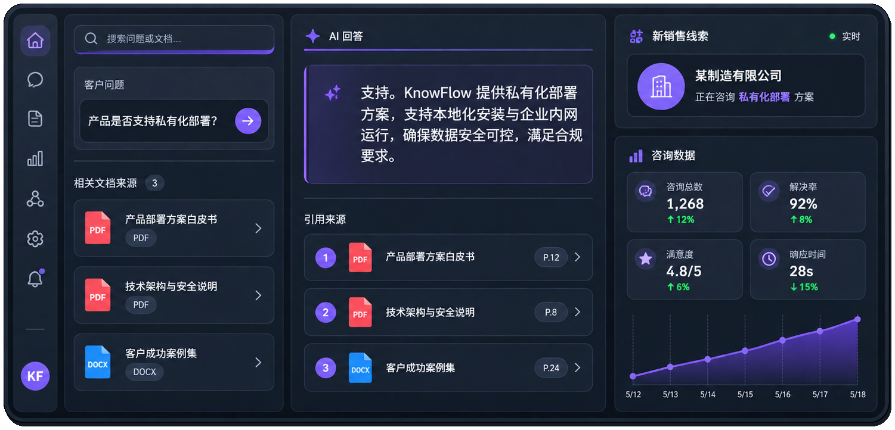
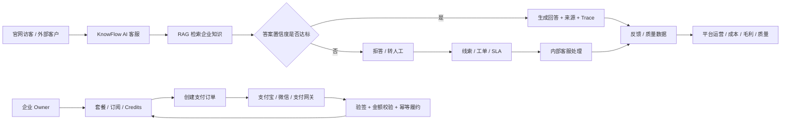
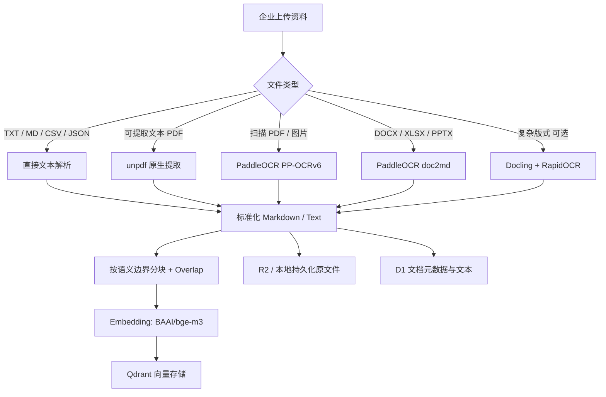
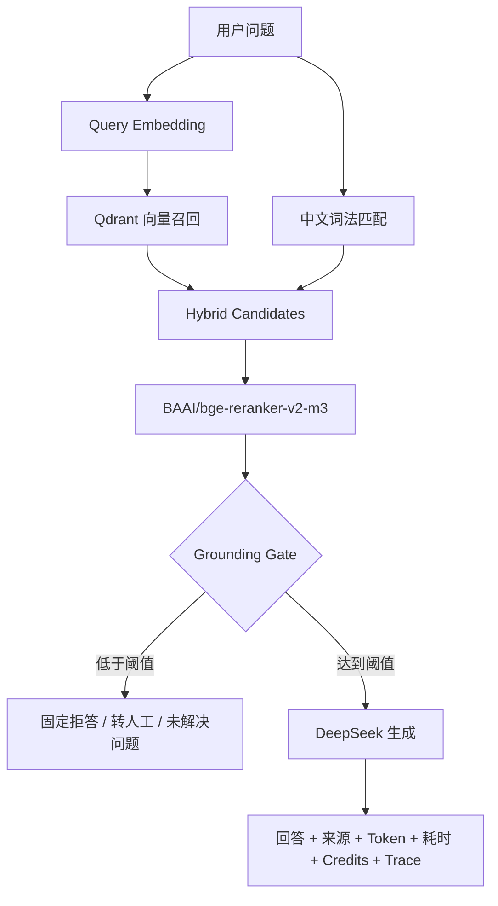
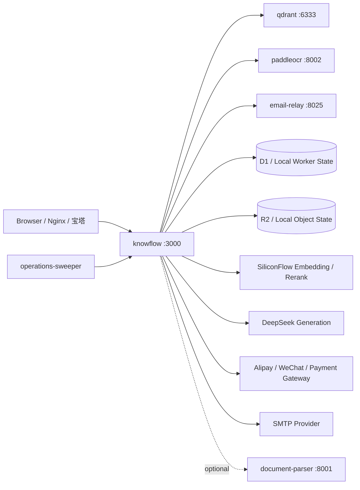
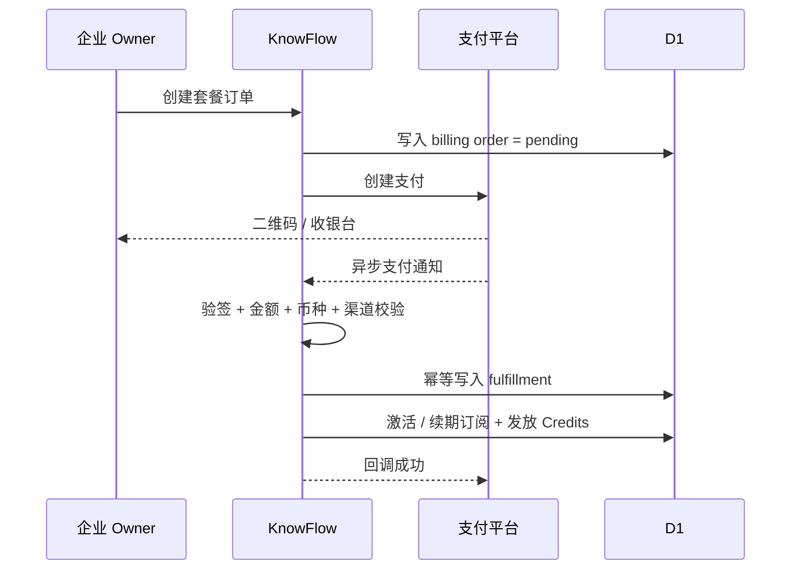

<div align="center">
  <h1>KnowFlow · Project4</h1>
  <p><strong>Enterprise AI Customer Service & Knowledge Operations SaaS</strong></p>
  <p>面向真实企业场景的 AI 客服、RAG 知识库、客户运营、订阅计费与支付一体化平台</p>

  <p>
    
    
    
    
    
    
    
    
    
  </p>
</div>

---

## 项目简介

**KnowFlow / Project4** 是一个以“企业真实可用”为目标持续演进的 AI 客服与知识运营平台。它并不是单纯的“上传 PDF + 聊天”Demo，而是把企业真正需要的多个业务环节放进同一套产品架构中：

> **企业资料 → OCR / 文档解析 → RAG 检索 → AI 客服 → 官网与渠道接入 → 人工客服兜底 → 线索与工单 → 套餐订阅 → 支付履约 → 成本 / 毛利 / 质量运营 → 备份与持续维护**

当前项目已经形成较完整的 SaaS 闭环，核心能力包括：

- 多租户企业账号体系与 RBAC 权限隔离；
- 企业知识库、文档解析、OCR、Embedding、Qdrant、Rerank 与 Grounding Gate；
- DeepSeek 生成模型与 OpenAI 兼容 API；
- 官网悬浮客服、企业工作台、内部运营后台、平台超级管理员后台；
- 客户线索、人工工单、SLA、反馈、质量测试与未解决问题管理；
- 套餐、订阅、Credits、订单、续费、退款申请与成本记录；
- 支付宝 RSA2、微信支付 V2 Native、通用支付网关适配；
- 本地 PaddleOCR 免费 OCR、Qdrant 向量库、邮件中继和定时运营巡检；
- Docker 私有化部署、GitHub CI、自动部署、健康检查、数据迁移与灾备设计。

项目目前处于 **Active Development / 持续迭代** 状态。核心业务链路已经基本打通，后续将长期围绕企业级安全、可观测性、渠道、Agent、支付、部署和商业化能力继续增强。

---

## 项目定位

KnowFlow 主要面向以下几类使用场景：

| 场景 | 典型需求 | KnowFlow 对应能力 |
|---|---|---|
| 企业官网 AI 客服 | 用企业自己的资料回答客户问题 | RAG、知识库、官网 Widget、来源引用、低置信拒答 |
| 售后与技术支持 | 产品手册、FAQ、故障文档很多 | OCR、PDF/Office 解析、混合检索、Rerank、人工工单 |
| 企业知识运营 | 文档持续更新，需要统一管理 | 多知识库、分类、文档、向量索引、重建、质量测试 |
| SaaS 商业化 | 不同企业按套餐使用 | 多租户、套餐、订阅、Credits、配额、账单、支付 |
| 客服运营 | AI 无法解决时需要人接管 | 负责人、优先级、SLA、线索、工单、通知 |
| 私有化交付 | 企业不希望核心文档离开自己的服务器 | Docker、PaddleOCR、Qdrant、本地持久化、配置加密 |
| API 能力输出 | 其他系统直接调用知识库与模型能力 | API Key、OpenAI 兼容 API、SSE、Trace |

如果把传统知识库系统、AI 问答系统、客服工单系统和 SaaS 订阅系统拆成四个独立产品，KnowFlow 的目标就是把这四层能力逐步合并到一个统一平台中。

---

## 当前完成度

> 下表区分“代码已实现”和“正式生产仍需要外部凭证/环境”的边界，避免把第三方平台开户条件误认为代码本身可以替代。

| 模块 | 当前状态 | 说明 |
|---|---|---|
| 企业多租户 | ✅ 已实现 | 企业、成员、角色、租户隔离、独立工作区 |
| 企业知识库 | ✅ 已实现 | 多知识库、分类、文档、分块、索引状态 |
| RAG | ✅ 已实现 | Embedding、混合召回、Rerank、阈值、拒答、Trace |
| 本地 OCR | ✅ 已实现 | PaddleOCR PP-OCRv6 small，图片/扫描 PDF 本机识别 |
| Office 解析 | ✅ 已实现 | PaddleOCR `doc2md` 支持 DOCX / XLSX / PPTX；另保留可选 Docling |
| Qdrant | ✅ 已实现 | 私有部署内置，按租户与知识库隔离向量 |
| AI 客服 | ✅ 已实现 | 官网问答、来源、反馈、人工兜底 |
| 客服运营 | ✅ 已实现 | 线索、工单、优先级、SLA、负责人、事件轨迹 |
| 套餐 / 订阅 | ✅ 已实现 | 套餐、订阅、Credits、配额、续费、到期处理 |
| 支付订单 | ✅ 已实现 | 统一订单、回调、查询、日志、幂等履约 |
| 支付宝 | ✅ 代码已实现 | 正式收款需企业自己的支付宝应用和 HTTPS 回调域名 |
| 微信支付 V2 | ✅ 代码已实现 | Native 扫码、查单、回调验签；正式支付需商户主体与 API V2 Key |
| SMTP 邮件 | ✅ 已实现 | 私有化邮件中继，支持注册与登录验证码 |
| OpenAI 兼容 API | ✅ 已实现 | `models`、`chat/completions`、`responses`、`embeddings`、Trace |
| 自动部署 | ✅ 已实现 | Git 拉取、Docker 构建、重建服务、健康检查、日志 |
| CI | ✅ 已实现 | Build、Tests、Python 语法、Shell、Compose 配置检查 |
| 完整生产合规 | ⚠️ 需企业配置 | HTTPS、商户、法务、隐私政策、监控、告警、备份策略需按部署环境完成 |

---

## 产品界面

<div align="center">
  
</div>

KnowFlow 当前采用三套职责分离的后台：

| 入口 | 使用者 | 主要职责 |
|---|---|---|
| `/platform` | 超级管理员 | 平台经营、模型服务、租户、套餐、支付、邮件、成本、系统资料、全局权限 |
| `/admin` | 内部运营 / 财务 / 客服 / 风控 | 企业审核、退款、客服任务、风险处理、运营工作流 |
| `/workspace` | 企业 Owner / Admin / Member / Viewer | 企业知识库、助手、质量测试、成员、账单、渠道、客服运营 |
| `/register` | 新企业 | 滑块验证 + 邮箱验证码后创建企业 Owner |
| `/setup` | 站点所有者 | 首次初始化平台超级管理员 |
| `/login` | 企业用户兼容入口 | 进入企业账号登录流程 |

这三套后台在 UI 上属于同一产品体系，但权限边界、路由校验和数据访问范围彼此独立。

---

## 从客户问题到商业闭环



这也是 Project4 与常见 RAG Demo 最大的区别：**RAG 只是能力中枢，而不是产品终点。**

---

# AI / RAG 架构

## 文档处理链路



## 问答检索链路



### RAG 设计重点

- 文本按句号、问号、换行等边界优先切分；
- Chunk 之间保留 overlap，减少关键信息落在切点的问题；
- 每次检索都限制 `tenant_id + knowledge_base_id`；
- 同时保留向量相似度与中文词法相关度；
- 独立 Rerank，不把生成模型当作唯一检索排序器；
- 低置信度问题可以直接拒答，不强行“编一个答案”；
- Rerank 服务异常时保留降级路径，不让整个客服链路直接中断；
- 文档、Chunk、Embedding 模型、向量维度、来源和 Trace 均可追踪；
- 质量测试与标准题回归用于验证“能不能稳定答对”，而不是只看聊天效果。

---

# 私有化服务拓扑

当前 `docker-compose.private.yml` 的核心服务如下：



| 服务 | 是否默认启动 | 作用 | 对外暴露 |
|---|---|---|---|
| `knowflow` | 是 | Web、API、业务逻辑、RAG 编排 | 宿主机 `127.0.0.1:3000` |
| `qdrant` | 是 | 向量存储与检索 | 宿主机 `127.0.0.1:6333` |
| `paddleocr` | 是 | 本地 OCR + Office doc2md | 宿主机 `127.0.0.1:8002` |
| `email-relay` | 是 | Python SMTP 中继 | 仅容器网络 |
| `operations-sweeper` | 是 | 每分钟执行过期、SLA、重试、清理任务 | 仅容器网络 |
| `document-parser` | 否，`parser` profile | 可选复杂文档解析：Docling + RapidOCR | 宿主机 `127.0.0.1:8001` |

> **生产建议：只对公网开放 Nginx / HTTPS 的 80、443。不要直接把 3000、6333、8001、8002 暴露到公网。**

---

# 技术栈

## Web / Full Stack

| 分类 | 技术 | 当前用途 |
|---|---|---|
| Framework | Next.js `16.2.6` | 页面、路由、服务端逻辑 |
| UI Runtime | React `19.2.6` | 交互界面与组件 |
| Language | TypeScript `5.9.3` | 主应用语言 |
| Build | Vite `8.0.13` | 构建与开发环境 |
| Worker Adapter | Vinext `0.0.50` | Next.js 与 Workers/Vite 运行链路 |
| Cloudflare | Wrangler `4.92.0` | Worker、本地 D1/R2 持久化、私有化运行 |
| Cloudflare Plugin | `@cloudflare/vite-plugin` | Cloudflare Runtime 集成 |
| ORM | Drizzle ORM `0.45.2` | D1 数据访问与数据库结构 |
| Database Migration | Drizzle Kit `0.31.10` | Schema 迁移 |
| Styling | Tailwind CSS `4.2.1` + CSS Modules / CSS | 页面样式 |
| PDF Native Parse | `unpdf` | 文本型 PDF 原生提取 |

## AI / RAG

| 能力 | 技术 / 模型 | 默认策略 |
|---|---|---|
| Generation | DeepSeek OpenAI-Compatible API | 平台统一配置 |
| Embedding | `BAAI/bge-m3` | 私有部署默认调用硅基流动 HTTPS API，1024 维 |
| Rerank | `BAAI/bge-reranker-v2-m3` | 默认复用 Embedding 的硅基流动 API Key |
| Vector DB | Qdrant `v1.15.4` | 私有部署本地运行 |
| Local OCR | PaddleOCR `3.7.0` | 默认本地免费 OCR |
| OCR Runtime | PaddlePaddle `3.3.1` | CPU 推理 |
| OCR Detection | `PP-OCRv6_small_det` | 本地检测模型 |
| OCR Recognition | `PP-OCRv6_small_rec` | 本地识别模型 |
| Office Parse | PaddleOCR `doc2md` | DOCX / XLSX / PPTX 转 Markdown |
| Optional Parser | Docling + RapidOCR | 复杂 Office / PDF 版式的可选服务 |
| Local Embedding Alternative | Infinity + `BAAI/bge-m3` | `docker-compose.open-source.yml` 可选完全本地方案 |

## Data / Infrastructure

| 能力 | 技术 | 说明 |
|---|---|---|
| Structured Data | Cloudflare D1 | 租户、账号、知识库、订单、工单、使用记录等 |
| Object Storage | Cloudflare R2 | 企业上传原文件 |
| Private Persistence | Wrangler / Miniflare state | Docker 私有化环境保存 D1 / R2 本地状态 |
| Vector Storage | Qdrant | 大规模向量检索 |
| Containers | Docker + Docker Compose | 私有化部署与服务隔离 |
| Reverse Proxy | Nginx / 宝塔 | 域名、HTTPS、反向代理 |
| CI | GitHub Actions | Build、Test、Shell、Python、Compose 检查 |
| Deployment | Git + `scripts/auto-deploy.sh` | GitHub → 服务器自动更新与重建 |

## Security / Auth

- PBKDF2-SHA256 密码哈希；
- 随机盐与不可逆密码存储；
- HttpOnly 会话；
- 登录失败锁定与首次改密；
- 平台 / 内部 / 企业三类入口隔离；
- 租户级 RBAC；
- 模型 / SMTP / 支付配置密钥使用 `CONFIG_ENCRYPTION_KEY` 加密；
- API Key Scope、RPM / TPM 控制；
- 本地 OCR / Qdrant 使用内部 Token 或 API Key；
- 对可配置外部服务地址做 SSRF 风险限制；
- 支付回调验签、金额校验、防重放和幂等履约。

---

# 核心功能矩阵

## 1. 企业知识库

支持：

- 多知识库；
- 文档分类；
- 文件上传与粘贴文本；
- PDF、DOCX、XLSX、PPTX、PNG、JPG、WEBP、TIFF、BMP、TXT、Markdown、CSV、JSON；
- 原始文档保存；
- 文本抽取；
- Chunk 数量、索引状态、OCR 状态；
- 全量重建；
- 内置系统资料“显示 / 应用”分离；
- 不同企业之间数据与检索隔离。

## 2. 本地免费 OCR

Project4 私有化部署默认走本机 PaddleOCR：

```text
企业上传扫描 PDF / 图片
        ↓
KnowFlow
        ↓
PaddleOCR API :8002
        ↓
PP-OCRv6_small_det + PP-OCRv6_small_rec
        ↓
Markdown / Text
        ↓
Chunk → Embedding → Qdrant
```

当前本地 OCR 设计特点：

- CPU 推理，不依赖 GPU；
- 不按页调用腾讯云 / 百度云，不产生云 OCR 次数费用；
- `PARSER_API_KEY` 作为容器间 Bearer Token；
- 服务启动时执行真实推理自检，避免“端口通了但模型实际不能跑”；
- `enable_mkldnn=False`，针对部分宿主机的 PaddlePaddle CPU / oneDNN 兼容问题做稳定性处理；
- 图片通过 Pillow 解码成 RGB 数组后再进入 OCR；
- PDF 可逐页处理；
- DOCX / XLSX / PPTX 可通过 PaddleOCR `doc2md` 转 Markdown；
- 本地 PaddleOCR 使用记录仍可以统计页数，但 OCR `cost_micros` 为 `0`；
- 超级管理员仍可以保存和测试百度 / 腾讯 OCR，必要时可切换到平台云 OCR。

## 3. RAG 质量控制

KnowFlow 的回答质量不是只靠 Prompt：

- 文档切片；
- Embedding；
- 向量召回；
- 中文词法补充召回；
- 独立 Rerank；
- 可靠度阈值；
- 无依据拒答；
- 标准题；
- 拒答题；
- 用户反馈；
- 来源追踪；
- Trace；
- 未解决问题沉淀。

## 4. 企业客服运营

- 官网悬浮客服；
- 独立聊天页；
- 域名白名单；
- 访客会话；
- 销售留资；
- 客户联系方式；
- 人工工单；
- 负责人；
- 优先级；
- 首响 / 解决时间；
- SLA；
- 事件轨迹；
- 未解决问题；
- 反馈；
- 通知重试；
- 运营统计。

## 5. 多租户 SaaS

- 企业注册；
- 企业 Owner；
- Admin / Member / Viewer；
- 企业资料；
- 成员创建；
- 临时密码；
- 首次登录改密；
- 租户切换；
- 成员禁用；
- 存储配额；
- Credits；
- 套餐功能权限；
- 使用量；
- 企业账单；
- 平台统一模型服务。

## 6. 平台经营后台

超级管理员可以统一处理：

- 企业租户；
- 平台账号；
- 套餐与商品；
- 模型服务；
- Embedding；
- Rerank；
- OCR；
- SMTP；
- 支付配置；
- Payment Lab；
- 成本规则；
- 收入 / 成本 / 毛利；
- 服务健康状态；
- 系统资料；
- 全局审计与经营信息。

---

# 支付、套餐与订阅

KnowFlow 已经把支付从“前端点击一下就升级”改造成真正的订单履约模型。

## 支付模块设计



## 已实现支付方式

### 支付宝

- RSA2；
- 应用私钥签名；
- 支付宝公钥验签；
- 支付回调；
- 主动订单查询；
- 支付日志；
- 幂等履约。

### 微信支付 V2 Native

- AppID；
- 商户号 `mch_id`；
- API V2 Key；
- `pay/unifiedorder` Native 扫码；
- `pay/orderquery` 主动查询；
- XML 回调；
- API V2 签名校验；
- 订单金额与第三方交易号一致性校验；
- Payment Lab 全局配置检查。

> 微信 V2 自动退款需要商户 API 证书 / 双向 TLS。当前设计会保留退款申请和人工处理链路，也可以后续接专用退款服务。

### 通用支付网关

项目同时保留支付网关适配器，可连接：

- 聚合支付；
- 企业已有支付中心；
- 独立支付微服务；
- 其他兼容 HMAC 回调的收银系统。

## 支付安全原则

- 浏览器只负责创建订单，不直接修改订阅；
- 支付成功必须由后端回调或可信主动查询确认；
- 回调先验签，再校验订单；
- 金额、币种、渠道不一致时不履约；
- 重复回调不会重复发放 Credits；
- 支付密钥不写日志；
- 正式支付必须使用 HTTPS 域名；
- 未完成真实商户配置前应保持 Sandbox / Disabled。

完整支付模块说明见：[`docs/Payment-Lab-支付模块.md`](./docs/Payment-Lab-支付模块.md)

---

# OpenAI 兼容 API

KnowFlow 可以作为企业内部 AI / RAG 服务被其他系统调用。

当前仓库包含：

```text
/v1/models
/v1/models/[model]
/v1/chat/completions
/v1/responses
/v1/embeddings
/v1/traces/[id]
```

同时支持企业 API Key 管理与服务端权限控制，可用于：

- 企业 CRM 调用；
- 内部 ERP / OA 调用；
- 自有前端调用；
- Agent / Workflow 调用；
- OpenAI SDK 兼容场景；
- 统一追踪请求来源与使用成本。

---

# 数据边界与租户隔离

KnowFlow 把 `tenant_id` 作为绝大多数业务数据的第一层隔离条件，并在知识检索中继续限定 `knowledge_base_id`。

典型租户数据包括：

- 企业与成员；
- 知识库；
- 分类；
- 文档；
- Chunk；
- API Key；
- 助手；
- 客服会话；
- 客户线索；
- 工单；
- 订阅；
- 订单；
- Credits；
- 成本；
- 使用记录；
- 渠道配置；
- 质量测试结果。

Qdrant Payload 同样写入租户与知识库标识，避免仅依赖前端控制数据范围。

---

# 项目目录

下面是 Project4 当前主要目录与职责。为便于阅读，仅展示核心结构：

```text
project4/
├── .github/
│   └── workflows/
│       └── ci.yml                  # GitHub Actions 持续集成
│
├── .openai/
│   └── hosting.json                # Worker / D1 / R2 Hosting 绑定
│
├── app/
│   ├── api/                        # 主业务 API
│   │   ├── admin/                  # 内部管理接口
│   │   ├── api-keys/               # 企业 API Key
│   │   ├── assistant/              # AI 助手
│   │   ├── auth/                   # 注册、登录、改密、验证码、滑块
│   │   ├── backup/                 # 备份与恢复
│   │   ├── billing/                # 套餐、订单、订阅、退款
│   │   ├── channels/               # 渠道接入
│   │   ├── commercial/             # 商业客服与运营
│   │   ├── knowledge/              # 知识库文档
│   │   ├── knowledge-bases/        # 多知识库
│   │   ├── knowledge-categories/   # 知识分类
│   │   ├── operations/             # 定时巡检
│   │   ├── payments/               # 支付回调 / 查单
│   │   ├── platform/               # 超级管理员接口
│   │   ├── privacy/                # 隐私 / 数据管理
│   │   ├── public/                 # 官网 Widget / 公共接口
│   │   ├── quality/                # 质量测试
│   │   ├── settings/               # 企业配置
│   │   ├── tenant/                 # 企业与成员
│   │   ├── usage/                  # 用量与成本
│   │   └── vector-store/           # 向量状态
│   │
│   ├── admin/                      # 内部管理员后台
│   ├── platform/                   # 超级管理员后台
│   ├── workspace/                  # 企业工作台
│   ├── chat/                       # 独立客服聊天页
│   ├── register/                   # 企业注册
│   ├── setup/                      # 首次初始化
│   ├── v1/                         # OpenAI-Compatible API
│   └── widget.js/                  # 官网客服嵌入脚本
│
├── components/
│   ├── enterprise-sync.tsx         # 企业端同步组件
│   ├── global-widget-gate.tsx      # 全局 Widget Gate
│   └── public-ai-widget.tsx        # 官网 AI 客服组件
│
├── db/
│   ├── index.ts                    # D1 / Drizzle 入口
│   └── schema.ts                   # 数据库结构定义
│
├── drizzle/                        # 数据库迁移
│   ├── 0000_*.sql
│   ├── ...
│   └── 0018_*.sql
│
├── lib/
│   ├── app-auth.ts                 # 企业账号认证
│   ├── billing.ts                  # 套餐 / 订阅 / 订单
│   ├── channels.ts                 # 渠道能力
│   ├── cloud-ocr.ts                # 百度 / 腾讯 OCR 适配
│   ├── completion.ts               # 生成模型调用
│   ├── costs.ts                    # 成本计算
│   ├── crypto.ts                   # 配置加密
│   ├── customer-service.ts         # 客服业务逻辑
│   ├── knowledge.ts                # 知识库基础逻辑
│   ├── mail.ts                     # 邮件发送
│   ├── notifications.ts            # 通知与重试
│   ├── payment-config.ts           # 支付配置
│   ├── payment-crypto.ts           # 支付签名与加密
│   ├── payment-lab.ts              # Payment Lab
│   ├── platform-admin.ts           # 超级管理员鉴权
│   ├── provider.ts                 # 模型 / OCR Provider
│   ├── qdrant.ts                   # Qdrant 适配
│   ├── rag.ts                      # RAG 核心
│   ├── runtime.ts                  # Worker Runtime Bindings
│   ├── security.ts                 # 安全工具
│   └── tenant.ts                   # 多租户核心
│
├── services/
│   ├── paddleocr/                  # PP-OCRv6 本地免费 OCR + doc2md
│   ├── document-parser/             # 可选 Docling + RapidOCR
│   └── email-relay/                # Python SMTP Relay
│
├── scripts/
│   ├── init-private.sh             # Linux 私有化初始化
│   ├── init-private.ps1            # Windows 私有化初始化
│   ├── start-private.sh            # D1 migration + Worker 启动
│   ├── auto-deploy.sh              # GitHub 自动部署
│   ├── build-from-github-archive.sh# GitHub Archive 构建
│   ├── verify-private-services.sh  # 私有化核心服务验收
│   ├── build-verified.sh           # 构建校验
│   └── install-ci.sh               # CI / 安装辅助
│
├── tests/                          # Node Test 测试集
├── worker/                         # Worker 入口
├── public/                         # 品牌、截图与静态资源
├── docs/                           # 商业化、支付、部署文档
├── Dockerfile.private              # 主应用镜像
├── docker-compose.private.yml      # 私有化完整栈
├── docker-compose.open-source.yml  # 可选本地模型 / 文档解析栈
├── wrangler.private.jsonc          # 私有化 Worker 配置
├── package.json
└── README.md
```

---

# 部署方式

KnowFlow 当前支持三种主要部署思路。

## 方案 A：Linux Docker 私有化部署（推荐）

最适合：

- 自有 Linux 服务器；
- 宝塔服务器；
- 企业私有化交付；
- 需要本地 PaddleOCR 与 Qdrant；
- 希望应用、OCR、向量库均由自己维护。

### 推荐环境

- Linux x86_64；
- Docker Engine 24+；
- Docker Compose v2；
- Node 构建阶段由 Docker 完成；
- 建议 4 核 CPU 或以上；
- 建议 8 GB RAM 或以上；
- 建议至少 30 GB 可用磁盘；
- 首次 PaddleOCR 模型下载需要联网；
- 正式环境建议使用公网域名 + HTTPS。

### 1. 拉取代码

```bash
git clone https://github.com/3037676975/project4.git
cd project4
```

如果已经使用宝塔 Git 自动部署，则进入现有项目目录即可。

### 2. 首次初始化

```bash
bash scripts/init-private.sh
```

脚本会自动：

1. 创建 `.env.private`；
2. 生成配置加密密钥；
3. 生成本地管理员随机初始密码；
4. 生成会话、OCR、Qdrant、支付、巡检、邮件中继等随机 Token；
5. 默认启用 `LOCAL_OCR_MODE=paddleocr`；
6. 构建 Docker 镜像；
7. 启动 KnowFlow、Qdrant、PaddleOCR、邮件中继和运营巡检；
8. 主应用启动时自动应用尚未执行的本地 D1 Migration；
9. 使用 Wrangler / Miniflare 持久化 D1 / R2 本地状态。

> `.env.private` 包含真正的运行密钥。**必须备份，但绝对不要提交到 GitHub。**

### 3. 验证核心服务

```bash
bash scripts/verify-private-services.sh
```

验证内容包括：

- KnowFlow Web；
- PaddleOCR 模型健康状态；
- PaddleOCR `doc2md` Office 能力；
- Qdrant Collections API。

### 4. 查看服务

```bash
docker compose --env-file .env.private -f docker-compose.private.yml ps
```

### 5. 查看日志

```bash
docker compose --env-file .env.private -f docker-compose.private.yml logs -f knowflow
```

PaddleOCR：

```bash
docker compose --env-file .env.private -f docker-compose.private.yml logs -f paddleocr
```

Qdrant：

```bash
docker compose --env-file .env.private -f docker-compose.private.yml logs -f qdrant
```

### 6. 重启

```bash
docker compose --env-file .env.private -f docker-compose.private.yml restart
```

### 7. 停止

```bash
docker compose --env-file .env.private -f docker-compose.private.yml down
```

> 不要随意删除 named volumes，否则可能造成 D1 / R2 本地状态、Qdrant 数据或模型缓存丢失。

---

## 方案 B：宝塔 + GitHub 自动部署

Project4 已经包含专门的自动部署脚本：

```bash
bash scripts/auto-deploy.sh
```

典型宝塔工作流：

```text
GitHub main 分支
      ↓
宝塔 Git 自动部署 / Webhook
      ↓
/www/wwwroot/project4
      ↓
scripts/auto-deploy.sh
      ↓
git fetch + reset
      ↓
Docker Build
      ↓
force recreate
      ↓
127.0.0.1:3000 健康检查
      ↓
部署完成
```

脚本会：

- 获取 `origin/main`；
- 对齐服务器当前代码与目标 commit；
- 避免重复部署相同 commit；
- 构建主应用；
- 检测并构建 PaddleOCR；
- 使用新镜像重建容器；
- 等待 KnowFlow 健康检查；
- 保存已部署 commit；
- 输出 `docker compose ps`；
- 将部署日志写入 `logs/deploy.log`。

如果服务器出现：

```text
fatal: detected dubious ownership in repository
```

可以在确认目录确实属于自己的项目后执行：

```bash
git config --global --add safe.directory /www/wwwroot/project4
```

### Nginx / 宝塔反向代理

正式部署建议把域名反向代理到：

```text
http://127.0.0.1:3000
```

示例 Nginx：

```nginx
location / {
    proxy_pass http://127.0.0.1:3000;
    proxy_http_version 1.1;
    proxy_set_header Host $host;
    proxy_set_header X-Real-IP $remote_addr;
    proxy_set_header X-Forwarded-For $proxy_add_x_forwarded_for;
    proxy_set_header X-Forwarded-Proto $scheme;
}
```

生产环境建议：

- 配置 TLS / HTTPS；
- 将 `APP_BASE_URL` 改成正式域名；
- 支付回调只使用 HTTPS；
- 仅公网开放 80 / 443；
- Qdrant、PaddleOCR、Docling 继续保持本机监听；
- 宝塔面板与 SSH 端口限制来源 IP。

---

## 方案 C：Cloudflare / Sites + 外部模型服务

项目本身以 Cloudflare Workers Runtime 为目标，因此可以在 Cloudflare / OpenAI Sites 风格环境中运行主应用。

托管模式下：

- D1 作为结构化数据库；
- R2 保存原始文档；
- Worker 负责业务 API；
- 模型、OCR、Qdrant 可以使用外部 HTTPS 服务；
- Python 模型不能直接运行在 Worker 内，需要单独服务器。

如果希望自建独立模型服务，可参考：

```text
docker-compose.open-source.yml
```

该 Compose 提供：

- Docling 文档解析；
- Infinity；
- `BAAI/bge-m3` 本地 Embedding。

当前 **Project4 私有部署默认不需要启动 Infinity**，而是把 Embedding / Rerank 交给硅基流动 API，以降低本机内存和模型磁盘占用。

---

# 可选 Docling 文档解析

PaddleOCR `doc2md` 已覆盖常见 DOCX / XLSX / PPTX。如果遇到复杂 PDF / Office 版式，可启用原有 Docling + RapidOCR 服务：

```bash
docker compose \
  --env-file .env.private \
  -f docker-compose.private.yml \
  --profile parser \
  up -d --build document-parser
```

该服务默认不参与普通私有化部署，避免无必要地增加构建时间、内存和模型缓存。

---

# 关键配置

`.env.private` 由初始化脚本生成。以下仅说明变量用途，**不要把真实值写进 README、Issue、截图或 Git。**

| 变量 | 用途 |
|---|---|
| `CONFIG_ENCRYPTION_KEY` | 数据库内服务商密钥的主加密密钥 |
| `LOCAL_AUTH_EMAIL` | 私有化本地超级管理员邮箱 |
| `LOCAL_ADMIN_PASSWORD` | 私有化本地初始密码 |
| `LOCAL_AUTH_SESSION_SECRET` | 本地登录会话密钥 |
| `PARSER_API_KEY` | PaddleOCR / Docling 内部服务鉴权 |
| `LOCAL_OCR_MODE` | `paddleocr` 或切换回平台 OCR |
| `QDRANT_URL` | Qdrant 地址 |
| `QDRANT_API_KEY` | Qdrant API Key |
| `QDRANT_COLLECTION` | 向量集合名 |
| `QDRANT_VECTOR_SIZE` | 向量维度，默认 1024 |
| `DEEPSEEK_API_KEY` | 可选环境变量生成模型密钥 |
| `SMTP_*` | SMTP 配置 |
| `MAIL_RELAY_TOKEN` | Python 邮件中继鉴权 |
| `PAYMENT_MODE` | `disabled` / `sandbox` / `production` |
| `PAYMENT_PROVIDER` | 支付网关模式 |
| `PAYMENT_CALLBACK_SECRET` | 通用支付网关回调签名密钥 |
| `OPERATIONS_SWEEP_SECRET` | 定时巡检接口鉴权 |

平台后台保存的 DeepSeek、Embedding、Rerank、OCR、SMTP 和支付密钥会经过配置加密后进入数据库，浏览器不会在后续读取时拿到完整明文。

---

# 模型服务配置

超级管理员进入：

```text
/platform → 模型服务
```

当前推荐：

| 能力 | 推荐配置 |
|---|---|
| Generation | DeepSeek 官方 / OpenAI 兼容接口 |
| Embedding | 硅基流动 `BAAI/bge-m3` |
| Rerank | 硅基流动 `BAAI/bge-reranker-v2-m3` |
| OCR | 私有化默认内置 PaddleOCR |
| Vector Store | 私有化默认 Qdrant |

Project4 私有化默认思路是：

> **大模型推理和 BGE 推理由云 API 承担，OCR 与向量库放在自己的服务器。**

这样可以在资源、成本、隐私和部署复杂度之间取得更实际的平衡。

---

# SMTP 与邮箱验证码

注册与验证码登录支持 SMTP。

私有化环境内置 `email-relay`，主应用通过内部 HTTP 调用 Python SMTP 中继。

典型 QQ 邮箱配置：

```text
SMTP_HOST=smtp.qq.com
SMTP_PORT=465
SMTP_USE_SSL=true
SMTP_USE_STARTTLS=false
```

注意：

- `SMTP_PASSWORD` 应填写 SMTP 授权码，不是邮箱登录密码；
- 不要将授权码提交到 Git；
- 生产环境建议使用企业邮箱或专用事务邮件服务。

---

# 渠道与官网 Widget

项目包含官网 AI 客服与多渠道能力基础：

- 官网悬浮 Widget；
- 独立客服页；
- 域名白名单；
- 访客会话；
- 企微；
- 微信公众号；
- 钉钉；
- 飞书；
- 通用 Webhook；
- 邮件 / 短信通知适配。

第三方渠道是否能正式上线，取决于企业是否拥有对应平台的认证主体、应用凭证、回调域名和必要权限。

---

# 质量、Trace 与成本

KnowFlow 把“AI 能回答”与“AI 值不值得信”分开处理。

当前设计记录：

- 召回来源；
- Vector Score；
- Lexical Score；
- Rerank Score；
- Confidence；
- 使用模型；
- Prompt Token；
- Completion Token；
- 延迟；
- 来源数量；
- Credits；
- 实际成本估算；
- OCR 页数；
- 企业收入；
- 退款；
- 毛利与毛利率。

本地 PaddleOCR 的成本记为 `0`，但仍保留使用记录，便于后续做系统资源成本模型。

---

# 数据备份与灾备

源码仓库 ≠ 业务数据备份。

正式环境至少需要同时备份：

1. GitHub 源码与版本号；
2. `.env.private`；
3. D1 / 本地 Worker State；
4. R2 / 本地对象数据；
5. Qdrant 数据；
6. 关键 Docker volumes；
7. 平台配置密文；
8. 业务导出文件；
9. 正式支付商户配置的外部安全备份。

私有化重要 volumes：

```text
knowflow-state
qdrant-data
paddleocr-cache
docling-cache
```

其中：

- `CONFIG_ENCRYPTION_KEY` 丢失后，历史加密配置可能无法恢复；
- API Key 和用户密码不会以可逆明文方式保存在数据库中；
- 支付私钥、SMTP 授权码等敏感信息不应只保存在服务器单点。

---

# 本地开发

## 环境要求

```text
Node.js >= 22.13.0
Python 3.11（仅本地 OCR 服务开发需要）
Docker / Docker Compose（私有化服务开发需要）
```

## 安装依赖

```bash
npm run install:ci
```

或：

```bash
npm ci
```

## 开发模式

```bash
npm run dev
```

## 构建

```bash
npm run build
```

## 测试

```bash
npm test
```

## Lint

```bash
npm run lint
```

## 数据库迁移生成

```bash
npm run db:generate
```

数据库结构：

```text
db/schema.ts
```

数据库迁移：

```text
drizzle/*.sql
```

私有化容器启动时，`scripts/start-private.sh` 会仅应用尚未执行的本地 D1 migration，然后启动 Wrangler Worker。

---

# CI / 质量门禁

`.github/workflows/ci.yml` 会在 `main` Push 和 Pull Request 时执行：

1. Checkout；
2. Node `22.13.0`；
3. Python `3.11`；
4. `npm ci`；
5. 应用 Build；
6. Node Test 测试集；
7. PaddleOCR Python 语法检查；
8. 私有化 Shell 脚本语法检查；
9. `docker compose config` 配置检查。

这让 Project4 不只是“能在某一台服务器跑”，而是逐步形成可重复构建、可验证、可持续维护的工程流程。

---

# 生产上线检查清单

在真正让企业客户使用前，建议至少完成以下检查：

- [ ] 正式域名和 HTTPS；
- [ ] Nginx 只反代 `127.0.0.1:3000`；
- [ ] Qdrant / PaddleOCR 不暴露公网；
- [ ] 修改 `APP_BASE_URL` 为正式域名；
- [ ] `.env.private` 已备份并限制权限；
- [ ] DeepSeek 模型服务已测试；
- [ ] Embedding / Rerank 已测试；
- [ ] PaddleOCR 图片测试通过；
- [ ] PaddleOCR 扫描 PDF 测试通过；
- [ ] DOCX / XLSX / PPTX doc2md 测试通过；
- [ ] Qdrant 健康检查通过；
- [ ] 至少两家测试企业验证租户隔离；
- [ ] 标准题与拒答题回归通过；
- [ ] SMTP 验证码真实送达；
- [ ] 支付宝 / 微信正式商户参数已完成；
- [ ] 支付回调使用 HTTPS；
- [ ] 重复支付回调不会重复履约；
- [ ] 套餐续费、到期、退款流程验证；
- [ ] 备份 / 恢复演练；
- [ ] 隐私政策与用户协议已完成；
- [ ] 服务器监控、磁盘、CPU、内存告警已配置；
- [ ] 生产日志不输出密钥和隐私数据。

---

# 常用运维命令

## 服务状态

```bash
docker compose --env-file .env.private -f docker-compose.private.yml ps
```

## 全部日志

```bash
docker compose --env-file .env.private -f docker-compose.private.yml logs -f
```

## 仅主应用

```bash
docker compose --env-file .env.private -f docker-compose.private.yml logs -f knowflow
```

## 重新构建主应用

```bash
docker compose --env-file .env.private -f docker-compose.private.yml build knowflow
```

## 重新构建 PaddleOCR

```bash
docker compose --env-file .env.private -f docker-compose.private.yml build paddleocr
```

## 强制重建容器

```bash
docker compose --env-file .env.private -f docker-compose.private.yml up -d --force-recreate
```

## 验证服务

```bash
bash scripts/verify-private-services.sh
```

## 自动部署日志

```bash
tail -f logs/deploy.log
```

---

# Roadmap / 后续规划

Project4 会持续长期更新。以下是当前更适合作为下一阶段的规划方向，**均属于 Roadmap，不代表已经完成。**

## Phase 1 · 生产工程化

- [ ] 统一生产环境配置中心，减少 Compose 中的环境差异；
- [ ] 完整日志分级与结构化日志；
- [ ] 接入 OpenTelemetry / Metrics / Alerting；
- [ ] 服务级 CPU、内存、磁盘、队列、OCR 延迟监控；
- [ ] 自动备份、异地备份与恢复演练；
- [ ] 正式 Release、Tag、CHANGELOG 与版本升级说明；
- [ ] 镜像版本化与镜像仓库发布。

## Phase 2 · AI / RAG 深化

- [ ] PaddleOCR 更复杂表格 / 版面结构识别；
- [ ] 更完整的 RAG Eval 数据集版本管理；
- [ ] 自动识别低质量文档与无效 Chunk；
- [ ] Query Rewrite / Multi-Query Retrieval；
- [ ] Agent / MCP 工具调用；
- [ ] 工作流编排；
- [ ] AI 客服自动执行订单查询、售后查询、资料查询等业务动作；
- [ ] 人工反馈反哺知识库与评测集。

## Phase 3 · 企业能力

- [ ] OIDC / SSO；
- [ ] 企业微信 / LDAP / SCIM 用户同步；
- [ ] 更细粒度 RBAC / ABAC；
- [ ] 操作审计导出；
- [ ] IP 白名单；
- [ ] 更强的密钥轮换；
- [ ] 多环境 Dev / Staging / Production 分离。

## Phase 4 · 商业化深化

- [ ] 微信支付新版本适配器；
- [ ] 微信自动退款专用服务；
- [ ] 对账与结算；
- [ ] 优惠券；
- [ ] 企业合同与开票信息；
- [ ] Metered Billing；
- [ ] 套餐权益模板；
- [ ] 渠道商 / 代理商体系；
- [ ] 商业数据看板与续费预警。

## Phase 5 · 部署与规模化

- [ ] ARM64 镜像；
- [ ] Kubernetes / Helm；
- [ ] 多节点 Qdrant；
- [ ] S3 兼容对象存储抽象；
- [ ] 队列化文档处理；
- [ ] 大文件异步解析；
- [ ] 多区域部署；
- [ ] 蓝绿发布 / 灰度发布。

---

# 文档索引

| 文档 | 内容 |
|---|---|
| [`README.md`](./README.md) | 项目总览、技术架构、部署、运维与 Roadmap |
| [`docs/Payment-Lab-支付模块.md`](./docs/Payment-Lab-支付模块.md) | 支付宝 / 微信 V2 / Payment Lab / 回调与幂等履约 |
| [`docs/商业化优化方案.md`](./docs/商业化优化方案.md) | 商业化能力、验收标准、业务边界 |
| [`docs/源码交接与部署手册.md`](./docs/源码交接与部署手册.md) | 源码交接、部署、迁移、上线检查 |
| [`docs/paddleocr-local-architecture.md`](./docs/paddleocr-local-architecture.md) | PaddleOCR 本地 OCR 设计 |
| [`services/README.md`](./services/README.md) | Python / 模型辅助服务说明 |

> 部分历史文档可能保留旧架构描述，最终应以当前 `main` 分支代码、`docker-compose.private.yml` 和本 README 为准。

---

# 项目维护原则

Project4 后续长期维护遵循以下方向：

1. **先把业务闭环跑通，再增加模型复杂度。**
2. **可以本地化且性价比高的能力尽量本地化，例如 OCR 与向量库。**
3. **高资源模型服务优先使用成熟 API，避免无意义占用小型服务器。**
4. **所有企业能力都必须考虑租户隔离。**
5. **所有支付能力都必须经过服务端验签和幂等履约。**
6. **所有 AI 回答都应该能评估、能追踪、能拒答。**
7. **所有密钥都不应该出现在 GitHub、前端响应和日志中。**
8. **所有部署都应该可重建、可验证、可恢复。**
9. **README、部署文档和代码必须尽量保持同步。**
10. **持续迭代，但避免为了“看起来复杂”而堆积不必要组件。**

---

# 适合用于什么

KnowFlow / Project4 可以作为：

- AI 技术产品经理项目作品；
- 企业 RAG 客服 Demo；
- SaaS 产品原型；
- 私有化 AI 客服底座；
- 多租户知识库平台；
- OpenAI 兼容知识服务；
- 支付 + 订阅 SaaS 工程样例；
- OCR + RAG + Qdrant 工程实践；
- 客服 / 工单 / 线索一体化系统；
- 后续 Agent / MCP / Workflow 平台的业务底座。

---

# License / Commercial Use

当前仓库未单独声明标准开源许可证文件。公开可见不等于自动获得任意商用、再分发或二次销售授权。

如需将 Project4 用于正式商业交付、源码再分发或二次销售，请先按照项目所有者的实际授权策略确认使用范围。

---

<div align="center">
  <h3>KnowFlow · Build AI Customer Service That Can Actually Operate</h3>
  <p>RAG × OCR × Customer Service × Multi-Tenant × Subscription × Payment × Operations</p>
  <p><strong>持续开发 · 长期维护 · 面向真实业务闭环</strong></p>
</div>
